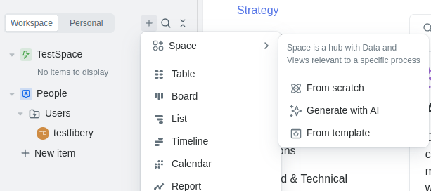
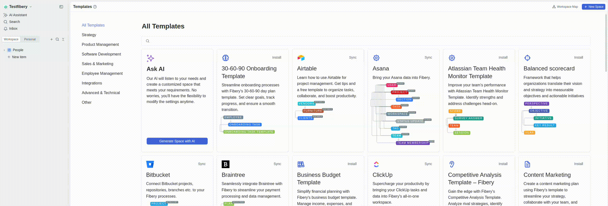

# Fibery API Demo Application

## Overview

This application serves as a demonstration of how to interact with Fibery using its REST API. It showcases the possibilities of integrating Fibery into custom projects and expanding the capabilities of existing workflows.

## Purpose

The primary goal of this application is to provide a practical example of how to leverage Fibery's API to automate tasks, retrieve data, and manipulate entities within the platform. By exploring this demo, developers can gain a deeper understanding of the API's capabilities and learn how to seamlessly integrate Fibery into their own projects.

## Features

- Demonstrates basic CRUD (Create, Read, Update, Delete) operations using Fibery's REST API.
- Showcases how to authenticate and authorize API requests.
- Provides examples of retrieving and manipulating various entity types, such as:
  - Entities
  - Relations
  - Fields
  - Workspaces
- Highlights best practices for error handling and debugging API interactions.

## Getting Started

To get started with this demo application, please follow these steps:

1. Clone the repository to your local machine:
   ```sh
   git clone https://github.com/onium16/fibery-api-demo.git
   ```

2. Navigate to the project directory:
   ```sh
   cd fibery-api-demo
   ```

3. Create a virtual environment and activate it:
   ```sh
   python3 -m venv venv
   source venv/bin/activate
   ```

4. Install the required dependencies using your preferred package manager:
   ```sh
   pip install -r requirements.txt
   ```

5. Create and configure your Fibery API credentials and workspace settings in a `.env` file:
   ```sh
   FIBERY_TOKEN=your_api_token
   FIBERY_WORKSPACE=your_workspace
   ```

6. Create an app with the name for demonstration "TestSpace":
    6.1 Select "+"
    6.2 Select "Space" -> "From Scratch" -> Enter name "TestSpace"
    

7. Run the application and explore the demo scenarios:
   ```sh
   python main.py
   ```

8. Next, observe the changes in Fibery



9. And observe the changes stages in the terminal


## Running Tests

To ensure the functionality of the application, run the unit tests included in the tests/ directory:
    ```sh
    python -m unittest discover tests
    ```

This will automatically discover and execute all test cases, verifying that the integration with Fibery API is working as expected.

## API Documentation

For detailed information on Fibery's REST API, please refer to the official documentation: [Fibery API Documentation](https://the.fibery.io/@public/User_Guide/Guide/Fibery-API-Overview-279).

## Contributing

We welcome contributions to this demo application. If you'd like to add new features, fix bugs, or improve existing code, please submit a pull request. Our team will review and merge your changes accordingly.

## License  

This project is licensed under the **Custom Non-Commercial License (CNCL)**.  
See the full license details here: [LICENSE.md](LICENSE.md)

## Acknowledgments

This demo application was created by SeriouS using Fibery's REST API. We appreciate the support and resources provided by the Fibery team in making this project possible.

